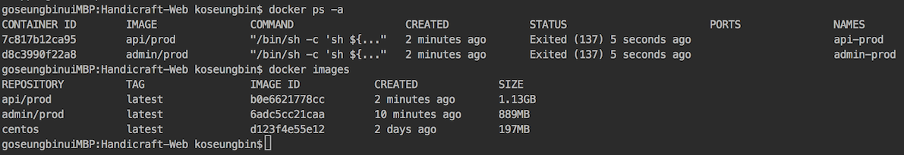

# Handicraft-Web 
[](https://travis-ci.org/TalentDonation/Handicraft-Web)        [](https://hub.docker.com/r/handicraft/web-master/)      []()                


## Overview

2017 SW 재능기부 챌린지
<br>
반쪽이 공방 __Admin Web Application__ 및 __RESTful API Server__ 개발

## Features

1. SPEC

    * Spring Boot + Mysql(JPA) (+ JSTL/Jquery )
    
    * Spring MVC 구조 중심으로 개발
    
    * Spring Security 적용
    
    * log4j + logback
    
    * Spring Boot Embedded Tomcat WAS 
    
    * Maven Wrapper 
    
    * Profile 에 따른 Docker Image, Container 생성 
    
    * Travis CI 를 이용하여 빌드 테스트
    
2. ADMIN WEB

    * Calendar 형식의 공방 일정관리 기능
    
    * AWS S3 를 이용한 3D 모델링 파일 관리 
    
    * Google SpreadSheets API 를 이용하여 회원 관리
    
3. API Server

    * RESTful API 

    * Naver Access Token 을 이용하여 Login 여부 확인 AES 암호화 방식의 Token 발급 
    
    * Swagger 를 이용하여 API 문서를 자동화
    

   
<br/>
    
## Configuration

* Docker Install
    
    Recommend Docker Engine release 17.06.0+

    > [Docker Install Reference](https://docs.docker.com/engine/installation)
    
    

* DockerHub Image Pull
    ```docker
    docker pull handicraft/web-master
    ```


<br/>
    
## Deployment

#### Docker Compose 
```docker
$ docker-compose up 
```

#### Docker 
```docker
 * Create Image  
 $ docker build -t api --build-arg projects=api/prod --build-arg profiles=production .
 
 * Create Container 
 $ docker run -d -p 8080:8080 --name api-prod api/prod
```

#### Docker Deploy Result



<br/>

## ThirdParty Libraries

* Spring Boot        - https://projects.spring.io/spring-boot
* JPA               - http://hibernate.org/orm/
* mysql-connector   - https://www.mysql.com/products/connector/
* swagger           - https://swagger.io/
* log4j             - https://logging.apache.org/log4j/2.x/
* logback           - https://logback.qos.ch/
* jquery            - http://jquery.com/
* aws-sdk           - https://github.com/aws/aws-sdk-java
* google-api-sdk    - https://github.com/google/google-api-java-client
* gogle-oauth-sdk  - https://github.com/google/google-oauth-java-client
* lombok            - https://projectlombok.org/
* apache dbcp2      - https://commons.apache.org/proper/commons-dbcp/
* commons-codec     - https://commons.apache.org/proper/commons-codec/
* sitemesh          - http://wiki.sitemesh.org/wiki/display/sitemesh/Home
* jstl              - https://sling.apache.org/
* fullcalendar      - https://fullcalendar.io/

<br/>
    
## Link

> [License](./LICENSE)

> [Dependencies License](./NOTICE)

> [DockerHub](https://hub.docker.com/u/handicraft/dashboard/)

> [Swagger](http://www.half-handicraft.com:8080/swagger-ui.html)

> [YouTube](https://www.youtube.com/watch?v=2OJIkFExcJ8&feature=youtu.be)
